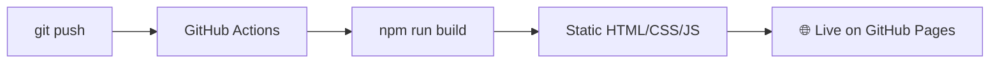

<div align="center">

# 👋 Usman Javaid — Portfolio


<p>
  <a href="https://usmanxjavaid.github.io"></a>
  <a href="https://github.com/usmanxjavaid/usmanxjavaid.github.io/actions"></a>
  <a href="LICENSE"></a>
</p>

<p>
  
  
  
  
  
</p>

</div>

<br>

## 📖 Table of Contents

- [✨ About](#about)
- [🧠 What's Inside](#whats-inside)
- [🛠️ Tech Stack](#tech-stack)
- [🚀 Getting Started](#getting-started)
- [✍️ Editing Content](#editing-content)
- [📬 Contact Form Setup](#contact-form-setup)
- [☁️ Deployment](#deployment)
- [🏗️ Project Structure](#project-structure)
- [❓ FAQ](#faq)
- [📄 License](#license)

---

## ✨ About

This is the source for my personal portfolio — a fully static, production-styled showcase of **8 real AI agents** I've built. Not demos: refund logic that respects order status, automatic model failover, live calendar sync, source-cited document Q&A.

> 🎯 **Built to be free, fast, and honest.** No database. No server. No login screen pretending to be a CMS. Content lives in one typed file, and the live site rebuilds itself on every push.

## 🧠 What's Inside

| Agent | Channel | What it does |
|---|---|---|
| 🛍️ **VeIvora** | Shopify | Order lookups, guardrailed refunds, live catalog Q&A |
| 🏥 **AxisCare** | WhatsApp | Natural-language appointment booking + RAG |
| 💬 **Community Healthcare** | WhatsApp | Adaptive RAG support agent |
| 📄 **DocuMind AI** | Web | Chat with your documents, cited by page |
| 🎧 **Nexora** | Telegram | 24/7 support with automatic model failover |
| 📅 **Appointment Booking Agent** | Telegram | Live-slot booking + auto reminders |
| 🎯 **Lead Generation Agent** | Telegram | Conversational lead capture & qualification |
| 🪙 **CoinSage** | Telegram | Crypto prices & market Q&A |

## 🛠️ Tech Stack

| Layer | Tools |
|---|---|
| **Framework** | Next.js — App Router, Static Export |
| **Language** | TypeScript |
| **Styling** | Tailwind CSS v4 |
| **Motion** | Framer Motion + Lenis smooth scroll |
| **Forms** | React Hook Form + EmailJS |
| **Theming** | next-themes (dark default, persisted toggle) |
| **Hosting** | GitHub Pages, via GitHub Actions |

## 🚀 Getting Started

```bash
git clone https://github.com/usmanxjavaid/usmanxjavaid.github.io.git
cd usmanxjavaid.github.io
npm install
npm run dev
```

Open **[localhost:3000](http://localhost:3000)** 🎉

## ✍️ Editing Content

Every project, skill, service, and bio line lives in **one file**: [`content/site.ts`](content/site.ts).

```ts
// Add a project — the whole site (cards, filters, detail page) picks it up automatically
{
  slug: "my-new-agent",
  name: "My New Agent",
  channels: ["Telegram"],
  // ...
}
```

Edit → save → push. No CMS, no admin panel — just TypeScript.

<details>
<summary>📋 Fields still marked <code>TODO</code></summary>
<br>

- `siteConfig.email`, `linkedin`, `resumeUrl`
- `siteConfig.emailjs` credentials (see below)
- `experience`, `education`, `testimonials`

</details>

## 📬 Contact Form Setup

The form sends mail **directly from the browser** — zero backend involved.

1. Create a free account at **[emailjs.com](https://emailjs.com)**
2. Add an email service + template
3. Paste your **Service ID**, **Template ID**, and **Public Key** into `siteConfig.emailjs`

## ☁️ Deployment

```
Repo → Settings → Pages → Source → GitHub Actions
```

Push to `main`, and [`deploy.yml`](.github/workflows/deploy.yml) takes it from there:



## 🏗️ Project Structure

```
.
├── app/                 → routes (Home, Projects, About, Contact)
├── components/
│   ├── sections/        → Hero, Skills, Services, Process...
│   ├── projects/        → cards, grid, filtering
│   ├── layout/          → Navbar, Footer, theme
│   └── ui/               → Button, Badge, GlassCard...
├── content/site.ts       → 🎯 the entire site's content
└── .github/workflows/    → auto-deploy pipeline
```

## ❓ FAQ

<details>
<summary><b>Why no database or admin dashboard?</b></summary>
<br>
By choice — this ships free on GitHub Pages, which can't run a server. All content lives in <code>content/site.ts</code> and doubles as version-controlled, git-tracked "CMS."
</details>

<details>
<summary><b>How is dark mode handled?</b></summary>
<br>
Via <code>next-themes</code>, defaulting to dark, with the visitor's choice persisted in their browser.
</details>

## 📄 License

Released under the **[MIT License](LICENSE)**.

---

<div align="center">

**[⬆ back to top](#-usman-javaid--portfolio)**

Built with 🤍 by [Usman Javaid](https://github.com/usmanxjavaid)

</div>